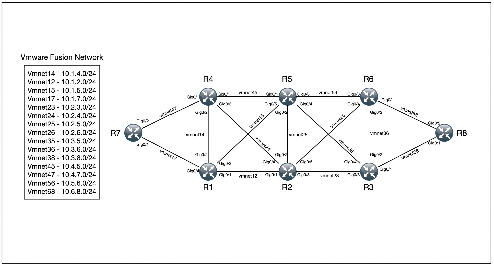

## Create Lab on Vagrant with Cisco vIOS 

Лаба на Vagrant с использованием Cisco vIOS и Ansible для предварительной настройки.  
Основа лабы Vmware Fusion.  
Для создания дополнительных интерфейсов VMNETXX используется [скрипт](https://github.com/alexeykr65/Fusion_Vmnet)  
Описание дополнительных интерфейсов согласно схеме, находится в файле ***fusion_network.cfg***  
Для создания интерфейсов необходимо запустить: 
`vmnet_cfg.py -a 'fusion_network.cfg' -s`  
Запуск лабы осуществляется командой: 
`vagrant up --provision-with "conf_int"` 
IP адреса интерфейсов описаны в файле ***src_cfg/vagrant_01.yml***, используются ipv4 и ipv6. 
Схема лабы ниже 

